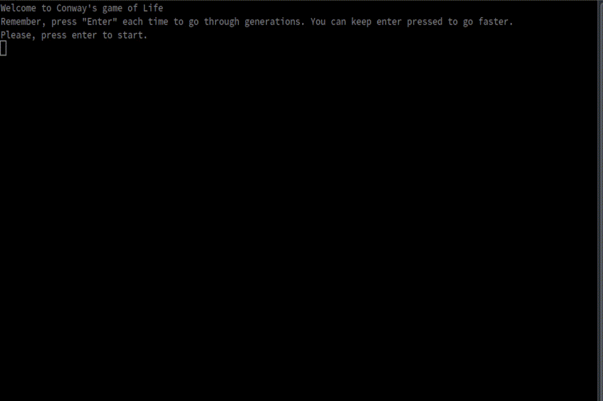

# Conway's Game
The main objective is to show a "Simulation" of the Conway's Game.

 - A live cell dies if it has fewer than 2 live neighbours
 - A live cell dies if it has more than 3 live neighbours
 - An unpopulated cell will become populated if it has 3 live neighbours
 - Otherwise, the cell has the same state in the next generation

## Main Loop

1. Create two grids, one to build (*next grid*) and other to show (*current grid*).
2. Populate current grid cells randomly
3. Display current generation grid 
4. Calculate the cell states of the current grid and put it into the next grid.
5. Copy the next grid to current grid
6. `goto 3`

## Optional Configurations
 - Velocity conf
 - Size (W*H) conf

